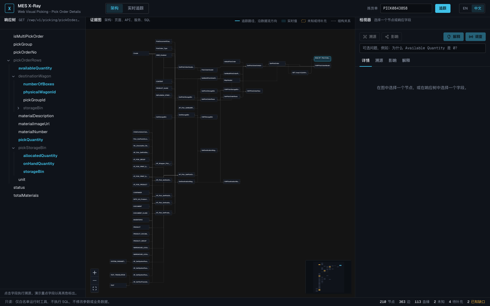
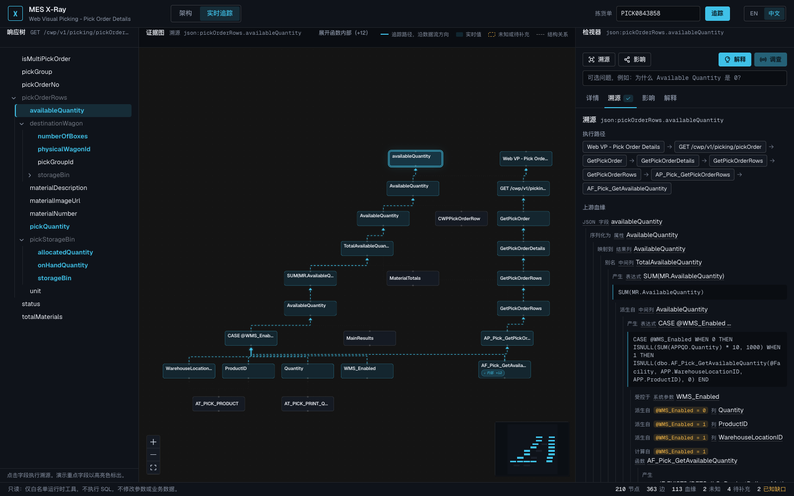
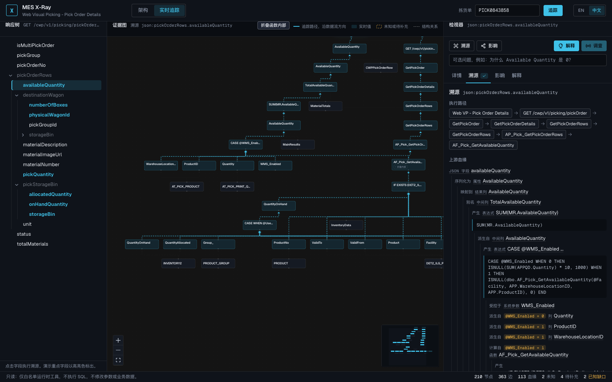
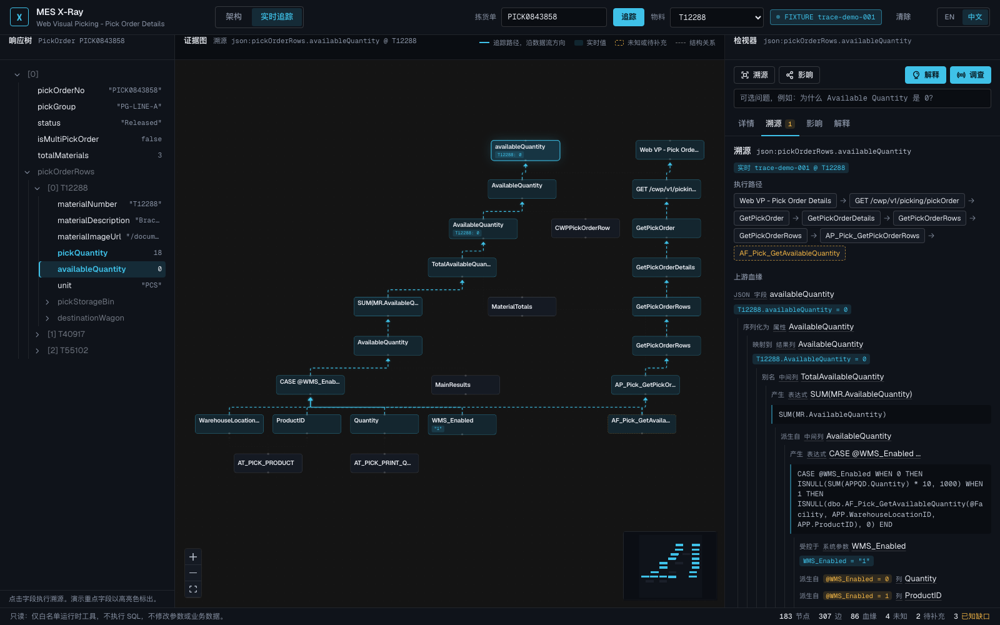
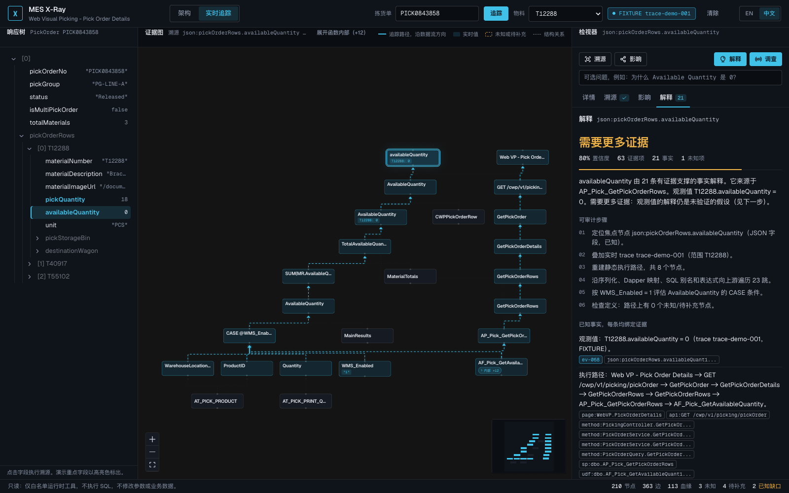
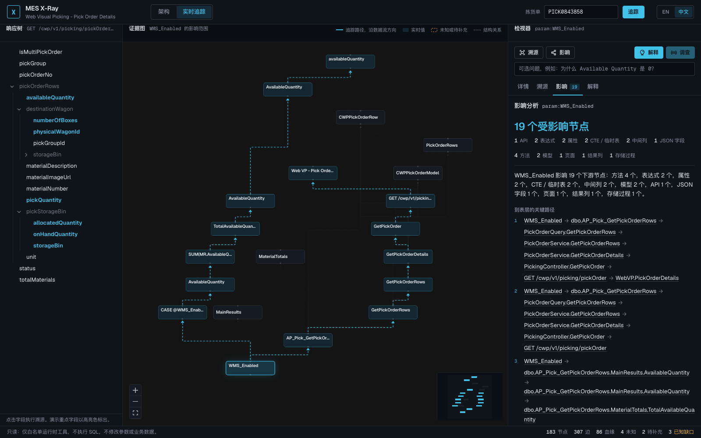
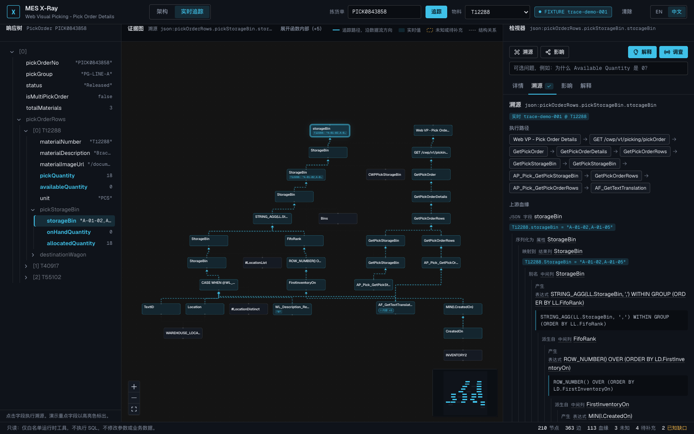
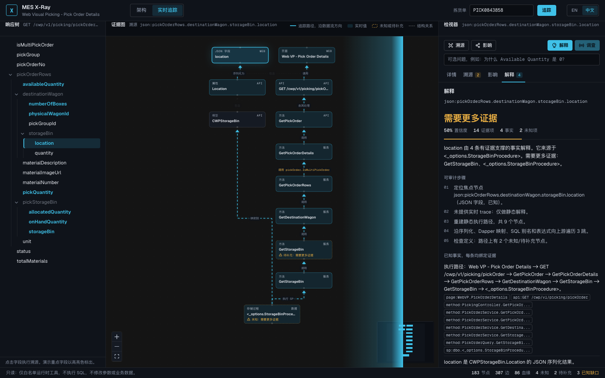

# MES X-Ray 五分钟讲稿（1024 Demo）

对应设计文档 §14 的七个阶段和 [`../demo-script.md`](../demo-script.md) 的操作细节。全程离线运行 `fixtures/pick-order-details`，不连生产、不执行 SQL、不改任何参数或数据。若要**录演示视频**（镜头表、叠字、片头片尾、剪辑清单），用 [`video-kit.md`](video-kit.md)。

- 演示订单 **PICK0843858**，物料 **T12288**（Bracket, left, zinc plated），运行时 trace `trace-demo-001`
- 开场前执行 `XRAY_LANG=zh scripts/xray.sh demo`：编译、启动、打印所有场景的深链、在浏览器打开场景 1。5173 被占用时脚本会自动换端口并打印实际 URL，下面的链接以打印结果为准
- 每个场景都有深链。点错了就贴链接，不要现场找回路
- 界面右上角 EN / 中文 可随时切换；AI 解释会用新语言重新生成，证据 id、取值和结论不变

时间预算（总计 5:00）

| 阶段 | 时间 | 场景 | 深链 |
|---|---|---|---|
| 1 | 0:00 - 0:30 | 架构全图 | `/?lang=zh` |
| 2 | 0:30 - 1:15 | 溯源 availableQuantity | `/?field=availableQuantity&lang=zh` |
| 3 | 1:15 - 2:00 | 实时追踪 | `/?order=PICK0843858&field=availableQuantity&scope=T12288&lang=zh` |
| 4 | 2:00 - 3:15 | 调查：进到 UDF 内部 | `/?order=PICK0843858&field=availableQuantity&scope=T12288&investigate=1&lang=zh` |
| 5 | 3:15 - 3:55 | WMS_Enabled 的影响 | `/?impact=param:WMS_Enabled&lang=zh` |
| 6 | 3:55 - 4:35 | storageBin 血缘 | `/?order=PICK0843858&field=json:pickOrderRows.pickStorageBin.storageBin&scope=T12288&lang=zh` |
| 7 | 4:35 - 5:00 | 回到全图 | `/?lang=zh` |

---

## 阶段 1（0:00 - 0:30）页面上只是一个 0

**动作**：打开场景 1，默认是「架构」视图。停一秒，让全图自己说话。

**台词**：
> 拣货单详情页上，T12288 这一行的 Available Quantity 显示 0。就一个 0。
> 这张图是这个 0 背后的全部链路：Web VP 页面、EBBA API、Controller、Service、Query，四个存储过程和一个函数，下面是表、CTE 和系统参数。一共 210 个节点、363 条边，都是扫描器从代码和 SQL 里读出来的，不是手画的。
> 今天要回答的问题只有一个：这个 0 是怎么来的，我们能不能证明它。

**看点**：右下角状态栏「210 节点、363 边、113 血缘、2 未知、4 待补充、2 已知缺口」。未知和缺口是公开的，不藏。

## 阶段 2（0:30 - 1:15）溯源：Web 到 SQL

**动作**：在左侧响应树点 **availableQuantity**（高亮色的是演示重点字段）。图切到「实时追踪」视图并聚焦这条链，右侧检视器打开「溯源」页。

**台词**：
> 一次点击。上面的执行路径是静态调用链：页面、`GET /cwp/v1/picking/pickOrder`、`GetPickOrder`、`GetPickOrderDetails`、`GetPickOrderRows`、Query 层的 `GetPickOrderRows`、存储过程 `AP_Pick_GetPickOrderRows`，最后到函数 `AF_Pick_GetAvailableQuantity`。
> 下面是上游血缘：JSON 字段序列化自属性，Dapper 按名映射自结果列，结果列是中间列 `TotalAvailableQuantity` 的别名，它是 `SUM(MR.AvailableQuantity)`，再往上是一个 CASE 表达式。
> 这个 CASE 按 `@WMS_Enabled` 分两支：0 走本地库存乘 10，1 走 UDF。两条分支的条件都在图上，参数是一条「受控于」的边。
> 血缘没有在函数调用处停下。`AF_Pick_GetAvailableQuantity` 的脱敏定义已经在 fixture 里，扫描器沿它的 RETURN 继续追：`IF EXISTS (... DeliveryMethod = 'LVP' ...) RETURN 1000 ELSE RETURN ISNULL(SUM(QuantityOnHand), 0)`，再进到 `InventoryData` 这个 CTE 的 CASE，最后落到 `INVENTORY2.QuantityOnHand` / `QuantityAllocated`、`PRODUCT_GROUP.Group_` 和 `DET2_ILG_ProductDeliveryMethod` 的几列。

**看点**：图沿数据流方向排布，自下而上；边上的标签就是关系类型。函数内部默认折叠在 `AF_Pick_GetAvailableQuantity` 上（芯片「内部 +n」），相机先框住执行路径和血缘主干，节点保持可读。点芯片或标题栏「展开函数内部」再钻进 RETURN / CTE / 基表列；也可以直接点右侧任意一跳，相机会滑到那个节点（藏在函数里的会自动展开），点最上面的字段本身回到全貌。这条链上没有虚线框。

## 阶段 3（1:15 - 2:00）实时追踪：把真实取值叠上去

**动作**：顶部输入 PICK0843858，点 **追踪**，物料选 T12288（或直接贴场景 3 的深链）。

**台词**：
> 现在把一次真实调用（脱敏后的 fixture）叠到图上。响应树变成了真实响应，图上的节点带上了取值。
> T12288：pickQuantity = 18，onHandQuantity = 0，allocatedQuantity = 18，availableQuantity = 0。`WMS_Enabled` 的运行时取值是 1。
> 注意来源：pickQuantity 是 `AP_Pick_GetPickOrderRows` 里对 `APPQD.Quantity` 的求和，onHand 和 allocated 来自 `AP_Pick_GetPickStorageBin`，三个数最后都落在表列上。Available 不一样：它是同一个存储过程里的 CASE，`WMS_Enabled = 1` 时走 UDF。所以它是 0 而别的不是，这不是巧合，是来源不同。

**看点**：节点上的取值芯片带 `T12288:` 前缀，表示是行级作用域；顶部 FIXTURE 徽标和 trace id 一直可见，说明数据来自哪里。图标题栏的「▶ 回放流转」把这次追踪播成动画：路径先变暗，调用沿执行路径逐节点向下、每条边上跑一个光点，然后取值沿血缘逐层向上，最后落进 `availableQuantity` 并亮出 `T12288: 0`（约 10 秒）。现场想让观众「看见流转」就点它一次；录视频用深链 `&replay=1`。

## 阶段 4（2:00 - 3:15）调查：假设就标假设

**动作**：点右上角 **调查**。

**台词**：
> 让调查器解释这个 0。结论是「需要更多证据」，置信度 80%，21 条事实，63 项引用证据，1 个未知。
> 先看可审计步骤：定位焦点节点、叠加 trace、重建执行路径、遍历 23 跳、按 `WMS_Enabled = 1` 评估 CASE 条件、检查定义（路径上 0 个未知节点）。这是它做了什么，不是它怎么想的。
> 每条事实后面都挂着证据芯片：`ev-068` 是运行时证据，其余是节点 id、边 id 和血缘 id。点任何一个芯片，图和检视器都会跳到对应节点。
> 关键的几条：本次 trace 生效的分支是 `@WMS_Enabled = 1`，走 `AF_Pick_GetAvailableQuantity`；函数内部，`EXISTS (... 'LVP' ...)` 那一支返回常量 1000，否则返回 `ISNULL(SUM(QuantityOnHand), 0)`；走哪一支取决于 `DET2_ILG_ProductDeliveryMethod` 的几列行数据，trace 里没有捕获这些行；局部变量 `@UseQuantityAllocated` 什么时候从 0 变成 1 也写成了事实。
> 然后是唯一一条假设，状态「未验证」：`AF_Pick_GetAvailableQuantity` 等于 `ISNULL(SUM(QuantityOnHand), 0)` 的回退值 0，内层很可能是 NULL，也就是 `INVENTORY2` 里没有匹配的库存行。附带一个只读的核查步骤：在 TEST 环境查这个物料在 `DET2_ILG_ProductDeliveryMethod`、`PRODUCT`、`PRODUCT_GROUP` 里的行。
> 注意区分：同一个字段点「解释」，结论是「已知」、90%，因为静态血缘每一跳都有证据；点「调查」问「为什么是 0」，答案依赖一条假设，所以是「需要更多证据」。这就是这个项目对 AI 的定位：证据说到哪里，结论就到哪里，剩下的标成假设并告诉你下一步去拿什么证据。

**看点**：审计块里有 provider、model、prompt 版本、时间戳和引用的证据 id 数。切一下 EN / 中文：句子换语言，证据 id、取值和结论完全不变。

对照备用：物料 T55102 的 availableQuantity 是 1000，把 scope 换成 T55102 再调查，假设变成「等于条件 `EXISTS (... DeliveryMethod = 'LVP' ...)` 成立时返回的常量 1000」；T40917 的 860 既不是常量也不是 ISNULL 回退值，结论直接是「已知」。

问答备用：
- 「这是 LLM 吗？」演示默认是离线规则引擎（provider `rules`）。接 OpenAI 兼容模型时，输出走同一个证据绑定校验器：引用了不存在证据的句子会被降级为假设，没有任何证据支撑的回答会被判为 Unknown。
- 「它会不会改数据？」不会。运行时适配器是只读白名单工具，第一版没有 UPDATE、DELETE、任意 SQL 和自动修复。状态栏那句话就是策略。

## 阶段 5（3:15 - 3:55）影响：一个参数怎么走到页面上

**动作**：点图上的 `WMS_Enabled` 节点（或阶段 4 里的证据芯片），再点 **影响**。

**台词**：
> 反过来问：如果有人切 `WMS_Enabled`，会影响什么？19 个下游节点。
> 关键路径两条：一条沿调用链，`WMS_Enabled` 到 `AP_Pick_GetPickOrderRows`、Query、Service、Controller、API，最后到 Web VP 页面；另一条沿数据流，CASE 表达式、中间列、结果列、`CWPPickOrderRow.AvailableQuantity`，最后到 JSON 字段 `availableQuantity`。
> 这是切参数之前该看的图，而不是切完以后现场排查。

**看点**：受影响节点按距离分组；每条路径都可以点进去。

## 阶段 6（3:55 - 4:35）storageBin：FIFO 和 STRING_AGG

**动作**：响应树点 `pickStorageBin.storageBin`（或贴场景 6 的深链）。

**台词**：
> 换一个复杂一点的字段。库位是 `STRING_AGG` 把 `#LocationList.StorageBin` 按 FIFO 顺序拼起来；FIFO 排名是 `ROW_NUMBER() OVER (ORDER BY FirstInventoryOn)`，`FirstInventoryOn` 是 `MIN(CreatedOn)`；库位本身又是一个 CASE，看 `WL_Description_Replacement`，ELSE 走 `WAREHOUSE_LOCATION.Location`。
> 实时取值 `"A-01-02,A-01-05"` 一路挂在链上。这条链每一跳都是已知的，溯源页上的徽标是一个对勾。

**对照（可选，20 秒）**：`destinationWagon.storageBin.location`。

> 这条链停在 `AP_Pick_GetPutStorageBin`，它标的是「待补充」。注意它是怎么被找到的：代码里存储过程名不是常量，是 `PickingOptions.StorageBinProcedure` 这个配置项；站点配置说它等于 `AP_Pick_GetPutStorageBin`，所以图上这条边的证据类型是 `configuration`、置信度 0.9，点开能看到引用的就是那条配置。而这个存储过程的定义我们还没拿到，X-Ray 就明确地停在这里，不猜里面的 `Location` 是怎么算的。拿到 `AF_Pick_GetAvailableQuantity` 定义之前，availableQuantity 那条链就是这个样子。

## 阶段 7（4:35 - 5:00）回到全图

**动作**：顶部点 **架构**。

**台词**：
> 回到全图收尾。X-Ray 不是一个聊天框。扫描器把代码和 SQL 变成证据图，运行时 trace 把真实取值绑到图上，AI 只允许基于这些证据说话，说不出来就说 Unknown。
> 状态栏一直写着我们的边界：只读、白名单工具、不执行 SQL、不改参数和数据。
> 第一个闭环已经走通：上周 `AF_Pick_GetAvailableQuantity` 还是图上的虚线框，拿到脱敏定义、重新扫描之后，availableQuantity 的溯源从「需要更多证据」变成了「已知」，多出来的 27 个节点、56 条边没有一条是手画的。目的车这条链也推进了一跳：站点配置给出了存储过程名 `AP_Pick_GetPutStorageBin`，边界从「哪个过程」变成了「这个过程的定义」。下一步同样具体：拿到它的定义，这条链也能变成「已知」。多拣货单流程不在这次演示范围内，图上保留为已记录的缺口。

---

## 彩排检查单

1. 演示前一天：`cd src/MesXray.Web && npm run e2e`。15 个 Playwright 用例会用本机 Chrome 把七个场景中英文各走一遍（自己起 API 和 Vite，不碰正在运行的演示栈），断言结论、数值、路径和语言切换。全绿再往下走。
2. `scripts/xray.sh status`：api 与 web 都是 healthy；记下 web 的实际端口。
3. 打开场景 4 的深链：应看到「需要更多证据」、80%、21 条事实、1 条假设。这一条通了，说明 API、图、runtime fixture、调查器全部在线。
4. 浏览器缩放 100%，窗口不小于 1280 宽；1400 以下会隐藏副标题和图例，这是设计行为。
5. 语言：演示前决定用 EN 还是中文，并在浏览器里切一次，让它记住。
6. 关掉其它占端口的项目不是必须的，脚本会自己换端口；但不要在演示中途重启它们。
7. 出错：贴当前场景的深链；API 不通时 `scripts/xray.sh restart --api-only --no-build`。

## 截图

本目录下的 PNG 由 `npm run demo:shots`（Playwright，1600 x 1000）生成，用的是和 e2e 用例同一份场景定义，UI 语言为中文；`02-trace-source-unfolded.png` 是场景 2 展开函数内部后的图，`04-investigate-en.png` 是场景 4 的英文版。改了界面或 fixture 之后重跑一次即可更新。它们只是讲稿的配图，现场以运行中的界面为准。
